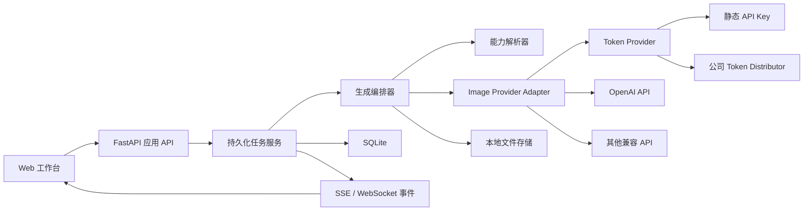

# ImageGenerater 完整产品与实施计划

> 文档状态：可执行规划稿  
> 基线日期：2026-07-30  
> 进度核验：2026-07-30（Phase 0–2 已验收）  
> 目标读者：接手实现的 AI / 开发者 / 验收人员  
> 本文不提供具体实现代码；实现者必须先阅读本文，再按阶段逐项开发和验收。

## 0. 实施进度总览

> 标记约定：`[x]` 已完成 · `[~]` 部分完成 · `[ ]` 未开始

### 0.1 分阶段任务（对应 §18）

- [x] **基线（§3.1）**：本地单人生图工具已可运行（文生图、单图编辑、WS、配置、历史）
- [x] **Phase 0**：基线与工程质量（测试目录、lint/format、CI、WS heartbeat 修复）
- [x] **Phase 1**：Provider 与 Token 抽象（多连接、Static / Distributor 可配置契约 + mock、连接测试）
- [x] **Phase 2**：SQLite、Asset 与持久化任务（迁移 JSONL、任务恢复、取消/重试）
- [ ] **Phase 3**：GPT Image 2 完整 Images API（多图参考、蒙版、格式/尺寸、错误分类）
- [ ] **Phase 4**：完整 Web 工作台（三模式、历史管理、设置、响应式）
- [ ] **Phase 5**：蒙版画布与流式 partial images
- [ ] **Phase 6**：Responses API 多轮编辑（可选）
- [ ] **Phase 7**：发布与运维（README/changelog、health、可选 Docker）

### 0.2 当前基线能力（§3.1，已有）

- [x] FastAPI + Jinja2 + Alpine.js 单页
- [x] `GET /v1/models` 模型列表
- [x] `POST /v1/images/generations` 文生图
- [x] `POST /v1/images/edits` 单张参考图编辑
- [x] `size` / `quality` / `n` 参数
- [x] 后台异步任务 + WebSocket 状态推送
- [x] 本地 `history.jsonl`、上传/输出目录
- [x] Base URL、API Key、默认模型；密钥与普通配置分文件
- [x] 开发依赖、pytest/ruff/mypy、CI、API 回归基线（Phase 0）
- [x] 多 Provider Profile、StaticBearer / TokenDistributor、`/api/v1/providers*`（Phase 1）
- [x] 旧 `/api/settings` 与 `/api/generate` 兼容；自动迁移为 default Provider
- [x] SQLite + migration、Asset 上传校验/缩略图、持久化 Job 队列与重启恢复（Phase 2）
- [x] `/api/v1/assets*`、`/api/v1/jobs*`（含 cancel / retry / delete）；JSONL 幂等迁移

### 0.3 计划能力缺口（§3.2 / 本轮必须，未做）

- [x] Provider / Token 解耦与多连接管理（Phase 1）
- [~] 公司 Token Distributor 认证（可配置契约 + mock 已完成；**真实联调仍待 §22**）
- [ ] 多图参考、排序、主图角色、蒙版编辑
- [ ] 真实输出格式 / MIME / 尺寸元数据（当前固定 `.png` 写盘；Asset 已记录 MIME/尺寸）
- [x] SQLite 持久化任务（重启可恢复）（Phase 2）
- [~] 取消已支持；真正的上游流式预览与受控 429 重试仍待 Phase 3/5
- [ ] 历史搜索、分页、收藏、标签、批量下载
- [ ] 稳定错误码、request ID、日志脱敏
- [x] 上传安全校验（大小、MIME、像素炸弹等）（Phase 2）
- [x] 自动化测试与 CI（Phase 0）
- [ ] 完整响应式工作台与任务恢复体验

### 0.4 第二阶段 / 暂不纳入

- [ ] Responses API 连续多轮编辑（§4.2 / Phase 6）
- [ ] Provider 能力自动探测与手动覆盖 UI
- [ ] Prompt 模板、风格预设、批量队列、成本估算
- [ ] 公网多租户 / 注册计费 / 云存储等（§4.3，明确不做）

### 0.5 最终验收清单进度（§21 摘要）

- [~] 连接：静态 Token / Distributor(mock) / 多 Provider / Secret 不回显（Phase 1；公司联调未完成）
- [ ] 生图：文生图完整参数闭环、多图、蒙版、合法自定义尺寸
- [~] 任务与历史：状态机、重启恢复、取消/重试（Phase 2）；搜索过滤下载待后续
- [ ] Web：引导、多图排序、蒙版、能力联动、移动端、无障碍
- [~] 工程：单测/合约/CI mock + JSONL 幂等迁移（Phase 0–2）；发布文档待后续

**当前结论**：Phase 0–2 已完成。下一步为 **Phase 3**（GPT Image 2 完整 Images API）。公司 Distributor 真实联调仍阻塞于 §22。

## 1. 项目目标

把现有的本地单人生图工具升级为一个稳定、易用、可扩展的 Web 生图工作台：

1. 以 OpenAI `gpt-image-2` 的官方能力为第一优先级。
2. 完整支持文生图、单图编辑、多图参考生成一张图、蒙版局部编辑。
3. 为后续“连续多轮编辑”预留 Responses API 通道。
4. 首要接入公司的 Token 分发系统，同时继续兼容静态 API Key 和其他 OpenAI-compatible API。
5. 让 Provider 差异、Token 获取方式、模型能力彼此解耦。
6. Web 页面达到日常可用水平：参数清楚、上传方便、进度可信、历史可管理、错误可理解。
7. 默认本地运行、密钥不进 Git、数据可迁移、失败可恢复、行为可测试。

### 1.1 成功标准

- 新用户只需完成一次“连接配置”，就能成功生成第一张图。
- 公司的 Token 分发流程不向业务层和前端泄漏 Token。
- 直接 OpenAI Images API 和至少一个 OpenAI-compatible 网关可通过同一套业务流程工作。
- 多图参考、蒙版编辑、任意合法尺寸、格式/压缩、审核级别均有完整前后端闭环。
- 任务刷新页面后仍可恢复查看，不因进程内字典丢失全部状态。
- 所有错误都映射为稳定的错误码、面向用户的提示和可排查的日志。
- 关键服务有单元测试，API 有集成测试，核心页面有端到端测试。

## 2. 官方能力基线

实现者不得仅凭记忆实现参数。开始 GPT Image 相关工作前，必须再次核对官方文档和实际目标网关。

官方资料：

- [GPT Image 2 模型页](https://developers.openai.com/api/docs/models/gpt-image-2)
- [OpenAI Image generation 指南](https://developers.openai.com/api/docs/guides/image-generation)
- [OpenAI API Reference](https://developers.openai.com/api/reference)

截至本文日期，需要遵循的官方事实：

- `gpt-image-2` 支持图像生成与图像编辑，Image API 对应：
  - `POST /v1/images/generations`
  - `POST /v1/images/edits`
- 文生图可通过 `n` 一次返回多张结果；“多张参考图生成一张新图”属于 edits/reference workflow，输入是一组图片，输出数量仍由 `n` 控制。
- 多图参考是官方能力；官方示例使用了 4 张输入图。不要把前端和领域模型限制为单图。
- 蒙版只作用于第一张输入图；GPT Image 将蒙版视为引导，不能承诺像素级严格贴合。
- 图片与蒙版必须尺寸、格式一致且小于官方上限；蒙版必须含 alpha 通道。
- `gpt-image-2` 自动以高保真处理所有输入图，不能为它发送可调的 `input_fidelity`。
- `gpt-image-2` 支持灵活尺寸，但必须满足：
  - 最长边不超过 3840 px；
  - 两条边均为 16 的倍数；
  - 长短边比例不超过 3:1；
  - 总像素在 655,360 到 8,294,400 之间。
- `quality` 支持 `low`、`medium`、`high`、`auto`。
- Image API 输出格式支持 `png`、`jpeg`、`webp`；JPEG/WebP 可使用 `output_compression`。
- `gpt-image-2` 当前不支持透明背景。UI 必须根据模型能力隐藏或禁用该项，而不是把无效值发给 API。
- Image API 和 Responses API 均支持流式部分图，`partial_images` 为 0–3；部分图可能少于请求数。
- Responses API 适合多轮对话式编辑；Image API 适合单次生成或编辑。第一阶段以 Image API 为主，不要为了“未来可能需要”强制把所有 Provider 都走 Responses API。
- 可对 `429` 和 `5xx` 做受控重试；用户输入错误和 `moderation_blocked` 不可原样自动重试。
- 日志应保存上游 request ID；用户界面显示通俗错误，内部日志保留稳定错误码与可选的 moderation details。

## 3. 当前项目基线

### 3.1 已有能力

- FastAPI 应用、Jinja2 页面和原生 Alpine.js 单页交互。
- `GET /v1/models` 模型列表。
- `POST /v1/images/generations` 文生图。
- `POST /v1/images/edits` 单张参考图图生图。
- `size`、`quality`、`n` 参数。
- 后台异步任务和 WebSocket 状态推送。
- 本地 `history.jsonl`、上传目录和输出目录。
- Base URL、API Key、默认模型配置，密钥与普通配置分文件保存。

### 3.2 主要缺口

- Provider 和 Token 获取写死在同一个 HTTP 客户端构造逻辑中。
- 只有一个全局连接，不能管理多个 Provider/环境。
- 图生图只接受单张文件，无法表达多参考图、排序、角色或蒙版。
- 所有输出固定保存为 `.png`，未保留真实 MIME、格式、尺寸、文件大小和上游元数据。
- 任务仅保存在进程内存，重启后任务状态丢失；JSONL 每次更新整文件。
- “进度”是人工阶段值，不是真正的上游流式预览。
- 无取消、重试、复制参数、批量下载、收藏、标签、搜索和分页。
- API 错误没有稳定错误码、request ID、重试分类。
- 缺少上传大小、类型、像素尺寸、解压炸弹、并发数、URL 安全等系统性防护。
- 没有自动化测试、格式化/静态检查和 CI 基线。
- 页面移动端导航逻辑不完整，连接状态和任务恢复较弱。

## 4. 范围与非目标

### 4.1 本轮必须完成

- Provider 配置和连接测试。
- 静态 Token + 公司 Token Distributor 两种认证方式。
- OpenAI Images Provider + OpenAI-compatible Images Provider。
- 文生图、多图参考、蒙版编辑。
- 输出格式、压缩、质量、合法自定义尺寸、数量、审核级别。
- 可持久化任务与历史。
- 完整 Web 工作台和响应式布局。
- 错误分类、日志脱敏、安全校验、重试和取消。
- 单元、集成、E2E 测试。

### 4.2 第二阶段增强

- Responses API 的多轮连续编辑会话。
- 流式 partial image 预览。
- Provider 能力自动探测与手动覆盖。
- Prompt 模板、风格预设、变量和常用负面约束。
- 批量任务、队列优先级、成本估算。

### 4.3 暂不纳入

- 公网多租户 SaaS、用户注册、计费和支付。
- 团队权限系统。
- 云对象存储和分布式队列。
- 模型训练、LoRA 管理或工作流节点编辑器。
- 规避上游内容政策的功能。

若未来部署到多人或公网环境，必须单独设计身份认证、租户隔离、审计和集中式 Secret Manager，不能直接复用本地单用户安全假设。

## 5. 目标架构



### 5.1 分层原则

1. `TokenProvider` 只负责获得可用凭证，不知道生图参数。
2. `ImageProvider` 只负责把统一请求映射到上游协议，不直接读页面表单。
3. `CapabilityResolver` 决定参数可否发送、默认值和兼容降级。
4. `GenerationOrchestrator` 负责验证、任务生命周期、重试、保存结果和事件。
5. 路由层只做协议转换、鉴权（如未来需要）和响应映射。
6. 前端只使用本项目稳定 API，不直接拼上游 `/v1/images/*` 请求。

## 6. Provider 与 Token 分发设计

### 6.1 Provider Profile

支持多个具名连接，例如“公司生产”“公司测试”“OpenAI 直连”“本地兼容网关”。

建议字段：

| 字段 | 说明 |
|---|---|
| `id` | 内部稳定 ID |
| `name` | 用户可读名称 |
| `provider_type` | `openai_images` / `openai_compatible_images` / 未来扩展 |
| `base_url` | 上游根地址 |
| `auth_type` | `static_bearer` / `token_distributor` |
| `default_model` | 默认模型 |
| `enabled` | 是否可选 |
| `verify_tls` | 默认必须为 true |
| `timeout_seconds` | 连接与总超时配置 |
| `extra_headers` | 受控附加请求头，禁止覆盖安全保留头 |
| `capability_overrides` | 对兼容网关的人工能力覆盖 |

Secret 字段不得进入公开设置接口，包括静态 Token、分发系统凭证、客户端密钥。

### 6.2 TokenProvider 统一契约

概念契约：

- `get_token(provider_id, force_refresh=False) -> AccessToken`
- `AccessToken` 至少包含：
  - token 值；
  - token 类型，默认 Bearer；
  - 可选 `expires_at`；
  - 可选来源标识，供日志记录但不得含 Secret。
- 同一 Provider 并发刷新必须 single-flight，避免大量任务同时打爆分发系统。
- 有过期时间时提前刷新，建议使用“固定提前量 + 少量随机抖动”。
- 无过期时间时使用配置 TTL；不得永久缓存。
- 上游返回 `401`/明确 token 失效时：
  1. 使当前缓存失效；
  2. 强制刷新一次；
  3. 只重放一次原请求；
  4. 再次失败则停止，不形成循环。

### 6.3 公司 Token Distributor Adapter

由于仓库中没有公司的真实协议，必须把以下内容做成可配置契约，不得把 URL、字段名或公司凭证硬编码进仓库：

- Token endpoint URL 或相对于 Distributor base URL 的路径。
- HTTP method。
- 认证方式，例如固定 Header、Basic、Client Credential 或公司自定义头。
- 请求体模板中的非敏感字段，如 scope、audience、model group。
- 响应中 token 字段路径。
- 响应中过期时间字段路径，支持 `expires_in` 或绝对时间。
- 可选的 token type 字段。
- Distributor 请求超时，默认应显著短于生图总超时。

建议实现顺序：

1. 先定义固定、清晰的 `TokenDistributorConfig` 模型。
2. 根据公司真实文档实现一个明确 Adapter。
3. 若确有多个格式，再增加“响应字段映射”；不要一开始就做可执行模板或脚本配置。
4. 提供“测试 Token 获取”按钮，但响应只显示成功、过期时间和掩码，绝不返回完整 token。

### 6.4 Secret 安全要求

- Secret 只保存在 `config/secrets.json` 或环境变量；默认不通过 GET API 返回。
- Secret 文件写入尽量采用仅当前用户可读权限。
- 日志、异常、任务记录、前端状态、WebSocket 消息不得包含 token。
- 对请求头和 JSON 日志字段做递归脱敏：`authorization`、`api_key`、`token`、`secret`、`cookie` 等。
- “导出设置”默认不含 Secret。
- 连接测试失败时不得回显完整请求头或 Distributor 响应正文。

## 7. 能力模型与兼容策略

### 7.1 能力矩阵

每个 Provider + 模型组合解析为一个 `ModelCapabilities`：

- `text_to_image`
- `image_edit`
- `multi_image_reference`
- `mask_edit`
- `max_input_images`
- `max_input_bytes_each`
- `max_input_bytes_total`
- `supports_n`
- `max_n`
- `qualities`
- `sizes` 或 `flexible_size_constraints`
- `output_formats`
- `supports_output_compression`
- `background_modes`
- `moderation_modes`
- `supports_partial_images`
- `max_partial_images`
- `supports_responses_conversation`
- `input_fidelity_mode`: `unsupported` / `configurable` / `always_high`

### 7.2 能力来源优先级

1. 应用内已验证的官方模型默认表。
2. Provider profile 的人工覆盖。
3. 可选的 Provider 自描述/探测结果。
4. 保守默认：只开放基础文生图或单图编辑。

`GET /v1/models` 只代表“模型存在”，不能证明每个图像参数都受支持。

### 7.3 参数发送策略

- 统一请求模型允许表达完整功能。
- Adapter 只发送目标 Provider 明确支持的字段。
- 不支持的用户显式参数应返回 `CAPABILITY_UNSUPPORTED`，不能静默忽略。
- 仅默认/自动参数在兼容模式下可按明确规则省略。
- 记录最终发送的“脱敏参数快照”，便于重现。
- 对 `gpt-image-2`：
  - 不发送 `input_fidelity`；
  - 不允许透明背景；
  - 使用灵活尺寸验证规则；
  - 允许多输入图和蒙版；
  - 蒙版永远对应第一张主图。

## 8. 统一领域模型

### 8.1 GenerationRequest

建议统一字段：

- `provider_id`
- `mode`: `generate` / `reference` / `edit_mask`
- `prompt`
- `model`
- `input_asset_ids[]`
- `primary_asset_id`
- `mask_asset_id`
- `size`: `auto` 或 `{width, height}`
- `quality`
- `n`
- `output_format`
- `output_compression`
- `background`
- `moderation`
- `partial_images`
- `seed`：只在 Provider 明确支持时出现
- `metadata`：仅允许受控键值，不接受任意深层对象

### 8.2 Asset

每个上传和输出都应有记录：

- ID、类别（input/mask/output/partial）。
- 相对存储路径。
- 原文件名和安全显示名。
- MIME、扩展名、字节数。
- 宽、高、颜色模式、是否含 alpha。
- SHA-256，用于去重和完整性检查。
- 创建时间。
- 父任务 ID。

### 8.3 Job

- `id`
- `status`: `queued` / `preparing` / `running` / `streaming` / `saving` / `succeeded` / `failed` / `cancel_requested` / `cancelled`
- `progress_kind`: `indeterminate` / `stage` / `upstream`
- `progress`
- `request_snapshot`
- `provider_id`
- `upstream_request_id`
- `attempt_count`
- `error_code`
- `error_message_public`
- `error_detail_internal`
- `created_at`、`started_at`、`finished_at`
- `parent_job_id`：重试或基于历史再编辑

### 8.4 Project / Collection（建议）

历史不应只是一条扁平列表。轻量实现：

- 默认 collection。
- 用户可创建 collection、重命名、收藏结果、添加标签。
- Generation 可归属于 collection。
- 后续多轮编辑可用 thread/session 关联一组 generation。

## 9. 本地持久化与迁移

### 9.1 SQLite

将元数据从 JSONL 迁移到 SQLite。图片仍保存在文件系统。

建议表：

- `providers`
- `provider_capabilities`
- `jobs`
- `assets`
- `job_assets`
- `collections`
- `tags`
- `job_tags`
- `schema_migrations`

数据库要求：

- 开启 WAL。
- 所有写入使用事务。
- 任务状态转换做条件更新，防止过期任务覆盖最终结果。
- 首次启动自动创建 schema，但必须有可追踪 migration version。

### 9.2 JSONL 迁移

- 检测 `data/history.jsonl`。
- 幂等导入：同 ID 不重复。
- 保留原始 JSONL，不自动删除。
- 迁移报告记录成功、跳过和失败数量。
- 旧文件对应的 outputs/uploads 路径继续有效。

### 9.3 文件布局

建议：

```text
data/
  app.db
  assets/
    input/YYYY-MM-DD/
    mask/YYYY-MM-DD/
    output/YYYY-MM-DD/
    partial/YYYY-MM-DD/
  exports/
  logs/
```

文件名只使用内部 ID 和经过允许的扩展名，不使用用户原文件名直接落盘。

## 10. 后端 API 设计

统一使用 `/api/v1`。旧接口保留一个过渡期，并在响应或日志中标记 deprecated。

### 10.1 Provider

- `GET /api/v1/providers`
- `POST /api/v1/providers`
- `GET /api/v1/providers/{id}`
- `PATCH /api/v1/providers/{id}`
- `DELETE /api/v1/providers/{id}`：有历史引用时默认软删除。
- `POST /api/v1/providers/{id}/test`
- `POST /api/v1/providers/{id}/refresh-models`
- `GET /api/v1/providers/{id}/models`
- `GET /api/v1/providers/{id}/models/{model}/capabilities`

连接测试分阶段返回：

1. 配置合法。
2. Token 获取成功。
3. 模型列表可访问。
4. 可选的最小生图测试必须由用户明确点击，避免产生费用。

### 10.2 Asset

- `POST /api/v1/assets`：多文件上传。
- `GET /api/v1/assets/{id}`
- `GET /api/v1/assets/{id}/content`
- `DELETE /api/v1/assets/{id}`：仅无引用资产可直接删除。
- `POST /api/v1/assets/validate-mask`

上传响应立即返回尺寸、格式、alpha、校验结果和缩略图 URL。

### 10.3 Generation / Job

- `POST /api/v1/generations`
- `GET /api/v1/jobs/{id}`
- `POST /api/v1/jobs/{id}/cancel`
- `POST /api/v1/jobs/{id}/retry`
- `GET /api/v1/jobs`
- `DELETE /api/v1/jobs/{id}`：默认删除记录和关联资产，须确认。
- `GET /api/v1/jobs/{id}/download`
- `GET /api/v1/jobs/{id}/export.zip`

### 10.4 事件

优先保留 WebSocket，也可将 SSE 作为更简单的单向事件通道。无论选哪种，都必须：

- 支持断线重连。
- 事件有递增序号或时间游标。
- 客户端重连后先拉取任务当前状态，再继续订阅。
- 心跳计时器不能在每次重连时重复创建。
- 事件类型稳定：
  - `job.created`
  - `job.status_changed`
  - `job.partial_image`
  - `job.completed`
  - `job.failed`
  - `job.cancelled`

### 10.5 统一错误响应

```json
{
  "error": {
    "code": "RATE_LIMITED",
    "message": "请求过于频繁，请稍后重试",
    "retryable": true,
    "retry_after": 12,
    "request_id": "local-request-id",
    "details": {}
  }
}
```

错误码至少包括：

- `CONFIG_INVALID`
- `TOKEN_FETCH_FAILED`
- `TOKEN_EXPIRED`
- `AUTH_FAILED`
- `MODEL_NOT_FOUND`
- `CAPABILITY_UNSUPPORTED`
- `INPUT_INVALID`
- `ASSET_TOO_LARGE`
- `ASSET_FORMAT_UNSUPPORTED`
- `MASK_INVALID`
- `MODERATION_BLOCKED`
- `RATE_LIMITED`
- `UPSTREAM_TIMEOUT`
- `UPSTREAM_UNAVAILABLE`
- `UPSTREAM_PROTOCOL_ERROR`
- `CANCELLED`
- `INTERNAL_ERROR`

## 11. 任务调度、重试与取消

### 11.1 本地队列

- 配置全局最大并发和每 Provider 最大并发。
- 超出并发进入 `queued`，UI 显示排队位置或至少显示排队状态。
- 使用 `asyncio.Queue` 可以作为本地版本起点，但任务真相必须在数据库中。
- 应用启动时：
  - `queued` 可重新入队；
  - `running/streaming/saving` 标记为 interrupted，再按策略失败或重试；
  - 不得永久卡在运行中。

### 11.2 重试

- 连接错误、读取超时、`429`、部分 `5xx` 可指数退避并加抖动。
- 尊重 `Retry-After`。
- 最大尝试次数和最大累计等待时间可配置。
- `400`、`401`（除 token 强刷一次）、`403`、`404`、审核拦截、无效图片不自动重试。
- 每次尝试保存 attempt 记录和上游 request ID。

### 11.3 取消

- 排队任务可立即取消。
- 运行任务触发本地取消信号并关闭上游连接。
- 若上游不支持真正取消，状态可变为 `cancel_requested`，返回后丢弃结果或按明确策略保存为“取消后到达”。
- UI 不得在用户点击取消后假装上游一定已停止计费。

## 12. 图像输入处理

### 12.1 上传

- 支持拖放、文件选择和从历史结果加入。
- 多图应保持用户排序；第一张标记为“主图”。
- 展示每张图的缩略图、尺寸、格式、文件大小和删除/拖拽排序。
- 前后端都校验，但以后端为准。
- MIME 需通过文件内容检测，不能只相信扩展名或浏览器 Content-Type。
- 解码时限制最大像素数，防止图片解压炸弹。
- 默认接受 PNG、JPEG、WebP；其他格式仅在 Provider 和处理库明确支持时开放。

### 12.2 多图参考

- 模式名称建议为“参考合成”，避免用户误解为普通单图编辑。
- 每张输入图可有可选“用途备注”，例如“保持人物”“参考服装”“参考构图”；业务层将其整理进 prompt，而不是发送私有字段给 OpenAI。
- UI 明确提示输入图越多，延迟和输入 token 成本可能越高。
- `max_input_images` 来自能力矩阵，不在前端写死为 4。
- 默认 `n=1`，但允许用户选择输出多张候选，前提是能力允许。

### 12.3 蒙版编辑

- UI 提供独立“局部编辑”模式。
- 第一版可支持上传蒙版；增强版提供画笔、橡皮擦、笔刷大小、撤销/重做、反选和清空。
- 编辑器导出与主图同尺寸、同格式、带 alpha 的蒙版。
- 提交前显示“将修改区域”的可视化覆盖层。
- 后端再次验证尺寸、格式、alpha。
- 多参考图 + 蒙版时，明确第一张为被编辑主图，其余仅为参考。
- UI 文案注明蒙版是模型引导，不保证严格边界。

## 13. 生图参数与 Prompt 体验

### 13.1 基础参数

- Provider。
- Model。
- 模式。
- Prompt。
- 数量 `n`。
- Quality。
- Size：常用预设 + 自定义宽高 + auto。
- Output format。
- Compression：仅 JPEG/WebP 显示。
- Background：根据能力显示；`gpt-image-2` 不显示透明选项。
- Moderation：默认 auto；是否向普通用户开放 low 由部署政策决定。
- Partial images：仅能力允许时显示。

### 13.2 高级参数区

默认折叠，避免主页面过载。所有字段都要有简短帮助文本和“不支持”原因。

### 13.3 Prompt 工具

- Prompt 历史与常用 Prompt 收藏。
- 风格预设：只作为可见、可编辑的文本片段，不隐藏神秘系统 Prompt。
- 结构化 Prompt 辅助项：主体、环境、构图、光线、风格、材质、文字要求、需要保持的元素、允许改变的元素。
- 一键“复制最终 Prompt”。
- 字数统计和常见风险提示。
- 不要承诺负面提示词是官方独立参数；若提供，只能明确说明会合并为自然语言指令。

## 14. Web 页面产品设计

### 14.1 信息架构

桌面端三栏：

1. 左栏：新建、项目/收藏、历史筛选、设置。
2. 中栏：画布/结果区，支持多结果网格、对比和大图查看。
3. 右栏或底部固定面板：输入、参考图、参数、生成按钮。

移动端：

- 左栏变抽屉，有独立菜单按钮。
- 参数面板变底部抽屉。
- 图片网格单列或双列自适应。
- 主要按钮位于单手可触达区域。

### 14.2 生成页

必须包含：

- Provider/模型状态。
- 三种清晰模式：文生图、参考合成、局部编辑。
- 多图上传与排序。
- Prompt 编辑器。
- 常用参数摘要，更多参数折叠。
- 预估信息：输出数量、尺寸、格式；成本仅在有可靠价格表时显示为“估算”。
- 生成、取消。
- 键盘快捷键，同时避免在 IME 中文输入候选期间误提交。

### 14.3 结果区

每个结果卡片支持：

- 放大。
- 单张下载。
- 复制图片。
- “以此继续编辑”。
- “添加为参考图”。
- 收藏。
- 查看详情：Prompt、模型、参数、耗时、Provider、尺寸、格式、文件大小、request ID。
- 多结果选择和 ZIP 下载。
- A/B 并排或滑动对比（对编辑前后尤其有用）。

### 14.4 历史页

- 分页/游标加载，不能一次固定加载全部。
- 搜索 Prompt。
- 按状态、模式、Provider、模型、日期、收藏、标签过滤。
- 卡片/列表视图切换。
- 批量下载、移动 collection、删除。
- 失败任务可查看原因并“修正参数后重试”。

### 14.5 设置页

分区：

- Provider 管理。
- Token/认证管理。
- 默认生成参数。
- 存储与清理。
- 并发、超时、重试。
- 隐私与日志。
- 关于与版本。

Provider 编辑器提供“保存”和“测试连接”两个不同动作。保存配置不能自动发起收费生图。

### 14.6 状态与可访问性

- Skeleton、空状态、错误状态、离线状态齐全。
- 真实未知进度用不确定进度条，不伪造百分比。
- partial images 可作为低清/中间预览，必须标记“预览”。
- Toast 用于短消息；关键错误留在页面中。
- 所有按钮有键盘焦点和 aria-label。
- 图片有合适 alt；纯装饰图片使用空 alt。
- 颜色不是状态的唯一表达方式。
- 支持 `prefers-reduced-motion`。

## 15. 前端技术路线

当前 Alpine.js 可以完成 MVP，但多图排序、蒙版画布、复杂历史筛选、持久化任务恢复会快速增加状态复杂度。

推荐两种选择：

### 方案 A：保留 Alpine.js（低迁移成本）

适合先完成后端与基础多图 MVP。要求：

- 将当前单个 `app()` 拆成模块：API client、generation store、asset uploader、settings store、event client。
- 不允许继续把所有状态和方法堆入一个对象。
- 蒙版编辑器使用独立模块。

### 方案 B：迁移到 Vue 3 + Vite（推荐的完整版本）

适合追求长期可维护的丰富 Web 工作台。建议：

- Vue 3 + TypeScript。
- Pinia 管理 Provider、任务、历史和编辑器状态。
- Vue Router 区分生成、历史、设置。
- 原生 Fetch 封装 API client；无需为了简单请求引入过重依赖。
- Canvas 模块用于蒙版编辑。

决策门槛：如果本轮确认要同时完成多图排序、蒙版画布、历史管理和多 Provider，采用方案 B；若只做后端能力和基础页面，先用方案 A。

无论选哪种，后端稳定 API 先行，页面不得耦合数据库字段。

## 16. 安全与可靠性

### 16.1 SSRF 与 Base URL

- Provider base URL 由本地管理员配置，不允许普通生成请求临时传 URL。
- 默认只允许 HTTP/HTTPS。
- 公网部署时应阻止 loopback、link-local、metadata IP 和内网地址，或改为 Provider allowlist。
- 禁止自动跟随到不受信任域的重定向。
- `verify_tls=false` 仅用于明确的本地测试，并在 UI 持续警告。

### 16.2 文件安全

- 所有文件访问通过 Asset ID，不接受任意路径。
- 解析后路径必须仍位于数据根目录。
- 响应设置正确 MIME、`Content-Disposition`、`X-Content-Type-Options: nosniff`。
- SVG 默认不作为输入或内联预览。
- 删除使用引用检查，避免删掉仍被历史任务复用的文件。

### 16.3 Web 安全

- 公网模式必须加身份认证、CSRF 防护和严格 CORS。
- Jinja/前端不得使用未清洗的 `innerHTML` 展示 Prompt 或错误正文。
- 设置安全响应头。
- CDN 依赖建议固定版本与 integrity，生产可改为本地打包，避免离线不可用和供应链漂移。

### 16.4 可观测性

结构化日志至少包含：

- 本地 request ID。
- job ID。
- provider ID。
- 模型。
- 上游 request ID。
- 阶段、耗时、尝试次数、HTTP 状态、稳定错误码。

不得记录：

- Token。
- 完整 Authorization header。
- 默认情况下的完整上传图字节/Base64。
- Distributor 原始响应。

提供 `/health/live` 和 `/health/ready`。ready 检查数据库和本地目录，不应每次都调用收费或限流的上游 API。

## 17. 测试计划

### 17.1 单元测试

- GPT Image 2 自定义尺寸边界和非法比例。
- CapabilityResolver 参数允许/拒绝/省略。
- Token 缓存、提前刷新、single-flight、401 强刷一次。
- Distributor 响应字段解析和过期时间。
- 错误解析、脱敏、request ID 提取。
- MIME 检测、图片像素上限、蒙版 alpha/尺寸验证。
- 路径安全和 Asset 引用删除。
- 任务状态机非法转换。

### 17.2 Adapter 合约测试

使用 MockTransport 或本地 mock server 验证：

- generations JSON 请求。
- edits 多文件 multipart，字段名和顺序正确。
- 多图与蒙版组合。
- base64 和 URL 两种上游响应。
- PNG/JPEG/WebP 保存扩展名正确。
- 429 + Retry-After、5xx、超时、401 刷新 token。
- moderation error 和非标准兼容网关错误。

测试中不得调用真实收费 API。

### 17.3 API 集成测试

- Provider CRUD 与 Secret 不回显。
- 连接测试分阶段结果。
- 多文件上传。
- 创建/查询/取消/重试任务。
- 历史过滤、分页、删除。
- WebSocket/SSE 重连后的状态恢复。
- JSONL 迁移幂等。

### 17.4 E2E

至少覆盖：

1. 首次启动 -> 新建 Provider -> 测试连接 -> 文生图 -> 下载。
2. 上传 4 张参考图 -> 调整顺序 -> 生成 1 张合成图。
3. 上传主图和蒙版 -> 校验 -> 局部编辑。
4. 任务中刷新页面 -> 恢复状态 -> 查看结果。
5. 429 后显示重试状态并最终成功。
6. 审核拦截显示可理解提示且不自动重复请求。
7. 移动端新建、打开历史、下载结果。

### 17.5 质量门禁

实现者应引入并固定以下命令，具体工具可按技术路线调整：

- Python 格式与静态检查。
- Python 测试与覆盖率。
- 前端 lint、typecheck、unit test。
- E2E test。
- 依赖安全检查。

CI 必须使用 mock，不需要公司 Token 或 OpenAI Key。

## 18. 分阶段实施任务卡

每个阶段由接手 AI 单独完成。不要把所有阶段塞进一次巨型改动。每阶段结束必须：

1. 列出修改文件。
2. 说明数据或 API 兼容影响。
3. 运行该阶段验收命令。
4. 更新 README 和本计划中的完成状态。
5. 保持一个可启动、可回滚的提交。

### Phase 0：基线与工程质量 — `[x] 已完成`

目标：建立可验证的开发基线，不改变现有产品行为。

任务：

- 补齐开发依赖和测试目录。
- 为现有 routes/services 写最小回归测试。
- 添加 lint、format、typecheck、pytest 配置。
- 添加 CI。
- 记录当前 API 响应作为回归基线。
- 修复 WebSocket 重连重复 heartbeat 的隐患。
- 确认所有文本文件 UTF-8。

验收：

- 无外部 API 时测试可运行。
- 现有文生图和单图编辑 mock 测试通过。
- 应用仍能启动。

交给 AI 的任务提示：

> 阅读 `docs/IMPLEMENTATION_PLAN.md` 的 Phase 0。只建立工程质量基线和现有行为回归测试，不实现新功能，不重构 Provider。使用 mock transport，禁止真实网络和收费 API。完成后给出命令输出与变更清单。

### Phase 1：Provider 与 Token 抽象 — `[x] 已完成`

目标：支持多个 Provider，并让认证来源与生图请求解耦。

任务：

- 新增 Provider Profile 和 Secret 配置模型。
- 实现 `StaticBearerTokenProvider`。
- 实现 `CompanyTokenDistributorProvider`，具体字段按公司接口文档配置。
- 实现 token cache、过期刷新、single-flight、401 强制刷新一次。
- 实现连接测试和模型刷新 API。
- 将现有 `_client()` 逻辑迁移到 Provider client factory。
- 保留旧 settings 的自动迁移。

验收：

- Secret 不出现在公开 API、日志和测试快照。
- 两种认证方式的合约测试通过。
- 多个 Provider 可独立切换。
- 旧用户配置可继续使用。

实施前必须向项目负责人确认：

- 公司 Distributor endpoint/method。
- 请求认证方式。
- token、token type、过期字段。
- scope/audience/model group。
- 错误码和限流语义。

交给 AI 的任务提示：

> 实现 Phase 1。先列出公司 Token Distributor 尚缺的协议字段；若文档未提供，使用明确的配置模型和 mock 示例，不得虚构公司地址或凭证。保持现有 `/api/generate` 兼容，新增逻辑必须有并发刷新和 401 单次重放测试。

### Phase 2：SQLite、Asset 与持久化任务 — `[x] 已完成`

目标：任务和历史可恢复，输入输出都成为受管理资产。

任务：

- 建立 SQLite schema/migration。
- 实现 repository 层。
- 实现 JSONL 幂等迁移。
- 实现 Asset 上传、元数据提取、内容检测、缩略图。
- 将 TaskManager 改为数据库状态机和本地队列。
- 启动时恢复 queued/interrupted 任务。
- 保留旧媒体 URL 的兼容处理。

验收：

- 重启后历史与任务可查询。
- 迁移运行两次不重复。
- 恶意路径、伪 MIME、过大像素图被拒绝。
- 并发更新不会把 succeeded 覆盖回 running。

交给 AI 的任务提示：

> 实现 Phase 2，只处理持久化、资产和任务状态，不添加多图 UI。使用 migration version，保留原 JSONL，不删除用户数据。提交前模拟应用重启并验证 queued/running 任务的恢复策略。

### Phase 3：GPT Image 2 完整 Images API — `[ ] 未开始`

目标：后端完整表达官方单次生图能力。

任务：

- 定义统一 GenerationRequest 和 ModelCapabilities。
- 实现文生图。
- 实现单/多参考图 edits multipart。
- 实现蒙版 edits。
- 实现合法任意尺寸验证。
- 支持 quality、n、format、compression、background、moderation。
- `gpt-image-2` 禁止透明背景和 `input_fidelity`。
- 保存真实输出格式、尺寸、字节数和上游 request ID。
- 建立错误分类与重试策略。

验收：

- 官方字段映射的 mock 合约测试通过。
- 4 图参考请求和“多图 + 第一图蒙版”请求通过。
- PNG/JPEG/WebP 均正确保存和下载。
- 非法尺寸在调用上游前失败。
- 429/5xx 受控重试；moderation 不重试。

交给 AI 的任务提示：

> 实现 Phase 3。严格对照本文链接的 OpenAI 官方文档；不要凭旧版 GPT Image 1 参数记忆实现。Provider 不支持的显式参数必须返回 `CAPABILITY_UNSUPPORTED`，不能静默吞掉。所有外部请求使用 mock 合约测试。

### Phase 4：完整 Web 工作台 — `[ ] 未开始`

目标：把后端能力转化为易用产品。

任务：

- 根据第 15 节选择 Alpine 模块化或 Vue 3；若实现全部丰富功能，优先 Vue 3。
- 实现三种模式。
- 多图拖放、排序、主图标识和历史复用。
- 完成参数面板和能力联动。
- 完成生成/取消、任务恢复、错误提示、partial placeholder。
- 完成结果操作、详情、批量下载。
- 完成历史搜索、过滤、分页、收藏、标签。
- 完成 Provider 设置与连接测试。
- 完成桌面和移动响应式布局、键盘和无障碍。

验收：

- E2E 核心流程全部通过。
- 360 px 宽移动视口无横向溢出。
- 刷新页面后任务与编辑上下文合理恢复。
- 不支持参数有清晰原因。
- 无 CDN 网络也能加载核心 UI（若采用打包方案）。

交给 AI 的任务提示：

> 实现 Phase 4。先根据后端 OpenAPI/稳定接口建立 typed API client，再实现页面；不要复制后端能力规则到多个组件。重点完成多图排序、蒙版工作流、任务恢复和移动端。使用 mock server 做 E2E，禁止依赖真实 Provider。

### Phase 5：蒙版画布与流式 partial images — `[ ] 未开始`

目标：提升编辑和等待体验。

任务：

- 画笔/橡皮擦/大小/撤销重做/反选/清空。
- 自动输出同尺寸含 alpha 蒙版。
- partial images 0–3 配置。
- 上游流事件转为本地稳定事件并保存可选临时预览。
- 最终图到达后正确替换 partial。
- 处理取消、断线重连和 partial 成本提示。

验收：

- 蒙版导出尺寸和 alpha 测试通过。
- partial 少于请求数时 UI 不报错。
- 最终图不会与 partial 重复计入结果。
- 断线重连后仍能获得最终状态。

交给 AI 的任务提示：

> 实现 Phase 5。蒙版以第一张主图为坐标系，后端必须再次验证。partial image 是临时预览而非最终资产；事件去重、断线恢复和最终替换必须有测试。

### Phase 6：Responses API 多轮编辑（可选增强） — `[ ] 未开始`

目标：提供“继续把它改成……”的连续会话体验。

任务：

- 独立 `ResponsesImageProvider`，不要破坏 Images Provider。
- 保存会话/response 关联和 revised prompt。
- 支持从历史结果继续编辑。
- 计算并显示 Responses 主模型额外 token 成本提示。
- Provider 不支持 Responses 时自动隐藏该模式，而不是改走猜测协议。

验收：

- 多轮上下文有持久化。
- 重启后会话仍可继续或明确提示不可恢复。
- Images API 单次流程不受影响。

交给 AI 的任务提示：

> 实现 Phase 6，作为独立 Provider 能力。不要把所有生图强制迁移到 Responses API。UI 清楚区分单次编辑和对话式连续编辑，并保留 revised prompt 元数据。

### Phase 7：发布与运维 — `[ ] 未开始`

目标：形成可分发版本。

任务：

- 完善 README、配置示例、迁移说明和故障排查。
- 提供版本号与 changelog。
- 提供本地备份/恢复和数据清理。
- 增加 health checks、日志轮转。
- 可选打包 Docker，但不得把 Secret 烘焙进镜像。
- 制作发布验收清单。

验收：

- 全新目录按照 README 可启动。
- 从旧版本升级不丢历史。
- 无 Secret 的默认配置可安全提交。
- 发布包不含本地数据库、图片、Token、日志。

## 19. 推荐提交边界

1. `test: establish regression baseline`
2. `feat: add provider profiles and token providers`
3. `feat: add sqlite repositories and asset management`
4. `feat: persist generation jobs and queue`
5. `feat: add gpt-image-2 capability resolver`
6. `feat: support multi-image and mask edits`
7. `feat: support output options and typed errors`
8. `feat: build provider settings experience`
9. `feat: build generation workspace`
10. `feat: add history management and downloads`
11. `feat: add mask editor and partial image streaming`
12. `docs: finalize migration and operations guide`

不要用一个提交同时迁移前端框架、数据库和 Provider 层。

## 20. AI 实施通用规则

交给其他 AI 时，任务开头附上以下约束：

1. 先阅读本计划、README 和相关现有文件。
2. 只完成指定 Phase，不顺手实现后续功能。
3. 不覆盖用户已有改动，不删除历史数据。
4. 不把公司地址、Token、Secret、真实响应样本写入仓库。
5. 不调用真实收费 API；使用 mock。
6. 所有新上游参数必须有官方文档或目标 Provider 文档依据。
7. 兼容网关能力不确定时，用 capability override，不用猜测。
8. 新增字段必须同时更新验证、持久化、公开 API、前端和测试。
9. 变更后运行本 Phase 的测试并报告结果。
10. 若发现计划与真实公司协议冲突，先记录差异并请求确认，不擅自扩大通用配置为可执行脚本。

## 21. 最终验收清单

### 连接

- [x] 静态 Bearer Token 可用。
- [~] 公司 Token Distributor 可用。（可配置契约 + mock；真实联调待 §22）
- [x] Token 缓存、刷新和 401 单次重放正确。
- [x] 多 Provider 切换正确。
- [x] Secret 不回显、不进日志、不进 Git。

### 生图

- [ ] 文生图。
- [ ] 单图编辑。
- [ ] 多图参考生成一张或多张候选。
- [ ] 第一主图 + 蒙版 + 其他参考图。
- [ ] 自定义合法尺寸。
- [ ] quality / n / format / compression / moderation。
- [ ] GPT Image 2 不发送 input_fidelity、不允许透明背景。
- [ ] 上游 request ID 和真实输出元数据已保存。

### 任务与历史

- [x] 排队、运行、保存、成功、失败、取消状态正确。
- [x] 重启恢复。
- [ ] 429/5xx 重试。
- [ ] moderation/输入错误不重试。
- [ ] 历史搜索、过滤、分页、收藏、标签。
- [ ] 单张/批量下载和继续编辑。

### Web

- [ ] 首次连接引导清楚。
- [ ] 多图拖放排序。
- [ ] 蒙版校验/画布。
- [ ] 能力驱动的参数显隐。
- [ ] 错误可理解。
- [ ] 移动端可用。
- [ ] 键盘和无障碍基本合格。
- [ ] 刷新与断线后状态恢复。

### 工程

- [~] 单元、合约、集成、E2E 测试通过。（Phase 0–2 单测/合约/集成已有；E2E 待 Phase 4）
- [x] CI 不使用真实 Secret。
- [x] JSONL 迁移幂等。
- [~] README、配置示例、升级和故障排查已更新。（基础已更新；运维专章待 Phase 7）
- [ ] 发布产物不含本地数据和凭证。

## 22. 实施前仍需业务方提供的信息

以下信息不会阻塞通用架构和 mock 开发，但会阻塞公司 Token Distributor 的真实联调：

1. Distributor 的 base URL、path 和 method。
2. 调用 Distributor 所需认证方式与 Secret 来源。
3. 请求字段：scope、audience、项目、模型组、用户标识等。
4. 响应 token 字段、token type、过期时间语义。
5. 失败响应、限流状态码、`Retry-After` 规则。
6. Token 是否绑定具体模型、Provider 或上游 base URL。
7. 是否允许客户端缓存，最长缓存时间和提前刷新要求。
8. 是否有测试环境和不会计费的健康检查。
9. 公司是否允许把 `moderation=low` 暴露给使用者。
10. 工具最终仅个人本机使用，还是会部署给团队共享。

在这些答案确认前，实现者应完成清晰 Adapter 接口、配置 schema 和 mock 测试，但不得声称公司 Token 联调已完成。

> Phase 1 状态（2026-07-30）：`TokenDistributorConfig`、`CompanyTokenDistributorProvider`、连接测试 API 与 mock 合约测试已落地；上表 1–8 项业务方信息仍缺，**不得视为公司 Distributor 已联调**。
